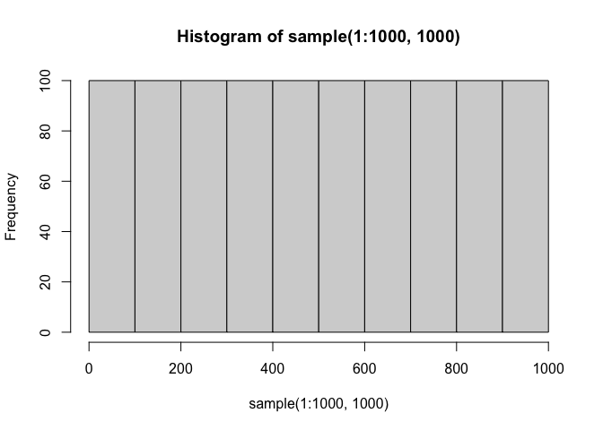
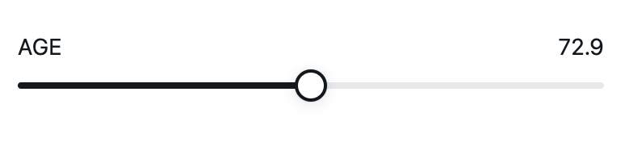
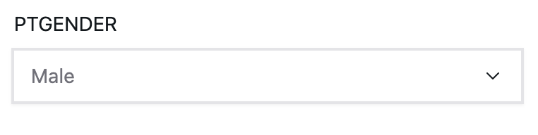

<!-- README.md is generated from README.Rmd. Please edit that file -->

# climo

<!-- badges: start -->
<!-- badges: end -->

The climo package is the R interface to the climo.ai platform. With the
climo package, you can create, evaluate, share, and collaborate on
clinical models directly from the R language. The climo.ai platform
follows the belief that individuals, labs, and companies can contribute
a great deal to building better clinical prediction models by sharing
models rather than entire datasets.

## Installation

You can install the development version of climo with the following
statement:

``` r
devtools::install_github("climo-ai/climo-r")
```

Additionally, to use most of the climo R functions you will need to
retrieve your API key from the climo.ai platform and set it in your R
environment. After signing in at climo.ai, navigate to Home \> Profile
and copy the API key. Then, run the following command in R to make your
key available for the climo package:

``` r
Sys.setenv('CLIMO_API_KEY' = '__your key__')
```

If you want the key to persist between R sessions, you can set the key
in your R environment by running `usethis::edit_r_environ()` and adding
the line `CLIMO_API_KEY="__your key__"` to the `.Renviron` file which
gets opened. That way you wont have to set the API key every time you
start R.

You can check that your API key is correctly set by running
`Sys.getenv('CLIMO_API_KEY')`

## Create your own model

Let’s say that you want to fit a mixed-effects model on data from
Alzheimer’s disease patients and then share it on the climo.ai platform.

First, you fit the model with your method of choice (here, the `nlme`
package):

``` r
library(nlme)
model <- lme(x ~ y, data)
```

Now, you can upload the model to climo.ai using the
`climo::create_model()` function. To create a climo model, you need at
least three things: a fitted object (e.g., lme object), a name for your
climo model, and a clinical area.

``` r
library(climo)
climo_model <- climo::create_model(model, name="example-model', area='Alzheimers Disease')
```

``` r
hist(sample(1:1000,1000))
```



It’s that simple! Now the model will exist on climo.ai and you can
navigate to it on the web via the URL
`climo.ai/{your_username}/example-model`.

To note, there are other parameters that can be set in the
`create_model()` functions – things like giving your model some tags,
setting the model visibility to private, or assigning your model to an
organization.

However, you won’t be able to actually see your model’s output at
climo.ai until you create the model signature which tells climo.ai how
to build the user interface which allows users to interact with your
model. We’ll show that next:

### Add model inputs

The model inputs make up the interactive user interface to your model on
the climo.ai platform. They’re necessary if you want users to be able to
interact with your model at climo.ai.

There are two types of model inputs: continuous inputs and categorical
inputs.

Continuous inputs are represented by sliders for numeric variables, as
shown here:



There are a couple of continuous input variables in our model (`AGE` and
`CDRSB_bl`), so we can create them as follows:

``` r
age_input <- climo::create_input('AGE', label='Age', type='continuous', min=50, max=90, step=1, initial=70)

cdrsb_input <- climo::create_input('CDRSB_bl', label='Baseline CDR-SB', type='continuous', min=0, max=10, step=0.5, initial=2.5)
```

Categorical inputs, on the other hand, are represented by dropdowns for
discrete variables.



There is also one categorical input variable in the model which we can
create in a similar way:

``` r
gender_input <- climo::create_input('PTGENDER', label='Gender', type='categorical', options=c('Male','Female'), initial='Female')
```

You may have noticed that the `time` variable from the model was not
assigned an input. That’s by design – for longitudinal models, you
usually want to fix the time values in order to display a disease
progression curve over time. Therefore, you should add the time variable
as a continuous input, but give it multiple values and specify that it
represents the time variable.

``` r
time_input <- climo::create_input('time', label='Years from baseline', type='continuous', options=c(0, 0.5, 1, 1.5, 2), is_time=TRUE)
```

Finally, we have the inputs for all of the five variables in the model
and we can actually add them to the model.

``` r
climo_model %>% add_inputs(
    age_input,
    cdrsb_input,
    gender_input,
    time_input
)
```

By adding the inputs to the model, they will actually show up at
climo.ai and users can interact with the model. You can see the example
at climo.ai/climo/example-r-lme

And just to note, if you ever lose track of your model then you can
always retrieve it back from the platform:

``` r
climo_model <- climo::retrieve_model('climo/example-r-lme')
```

The platform is smart enough to know which models are yours and which
aren’t based on your API key – so no one else besides you can edit your
models in any way.

### Add model display

### Add model details

## Evaluate another user’s model

## Contribute data to a federation

## Fit a federated model

## List all models
